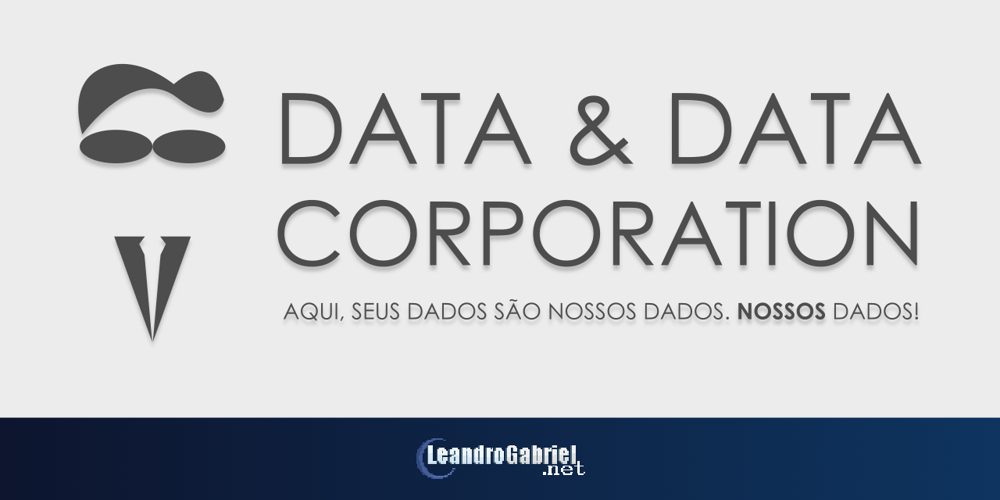

# Data & Data Corporation

http://datacorp.leandrogabriel.net/

# O que é exatamente?
*Data & Data Corporation* (ou, carinhosamente chamado de *DataCorp*) é um jogo simulador de programação avançado, onde você possui total controle sobre os dados que entram, e como quer que sejam retornados. Traduzindo, trata-se de uma fusão de Human Resource Machine, 7 Billion Humans (ambos da Tomorrow Corporation) e Automachef (Team17).

## É gratuito?

Sim, é gratuito. Nessa versão web, todo o projeto não só é gratuito como você pode contribuir também nele, ampliando-o cada vez mais.

Planejo fazer uma versão paga posteriormente, feita em outra engine, disponibilizando-a em lojas digitais.

## Quando fica pronto?

Só Deus sabe.